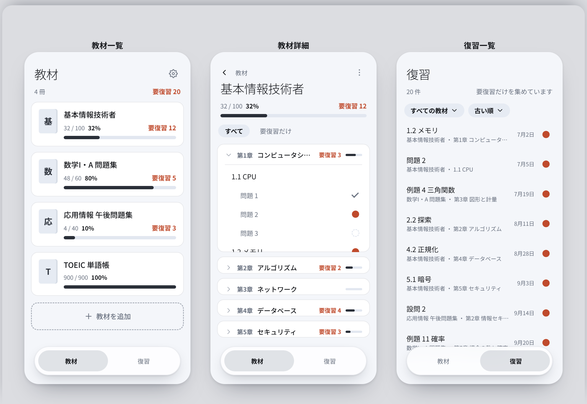

# Revia

紙の参考書・問題集の**目次を AI で読み取り**、章・節・問題ごとに「完了」「要復習」などの状態やメモを記録して、次に見直す箇所を管理する Android アプリ。

Kotlin + Jetpack Compose / minSdk 26 / targetSdk 36

[](https://showgo1130.github.io/Revia/ui/)

**→ [14 画面のデザインを見る](https://showgo1130.github.io/Revia/ui/)**（ブラウザで触れます。**実装前のモック**です）

> **開発中です。** 2026-09-23 時点で機能はまだ入っていません。設計と画面デザインが決まり、CI が緑で回る骨組みがある段階です。

## 設計

| もの | 中身 |
|---|---|
| [docs/concept.md](docs/concept.md) | なぜ作るか・誰のため・やらないこと |
| [docs/design.md](docs/design.md) | **何をどう作るか。** 14 画面・色や寸法の値・画面遷移。**値の正本** |
| [docs/decisions.md](docs/decisions.md) | 決定の記録（なぜそう決めたか、何を捨てたか） |
| [14 画面の見本](https://showgo1130.github.io/Revia/ui/) | ブラウザで触れる。**挿絵なので、食い違ったら `docs/` が正しい**（決定 37）。元は [docs/ui/index.html](docs/ui/index.html)、画像の撮り直しは [docs/ui/screenshot.md](docs/ui/screenshot.md) |
| [docs/research/ai-terms.md](docs/research/ai-terms.md) | 規約・権利の調査 |

## ビルド

```bash
# clone ごとに 1 回
git config core.hooksPath .githooks
echo "sdk.dir=<Android SDK のパス>" > local.properties

./gradlew testDebugUnitTest   # 単体テスト
./gradlew assembleDebug       # debug APK
```

JDK 17 以上が要ります。

## 公開していないもの

AI 解析の API キー、署名鍵、ユーザーが撮影した目次画像、個人の学習データ。詳細は [AGENTS.md の §3](AGENTS.md)。
